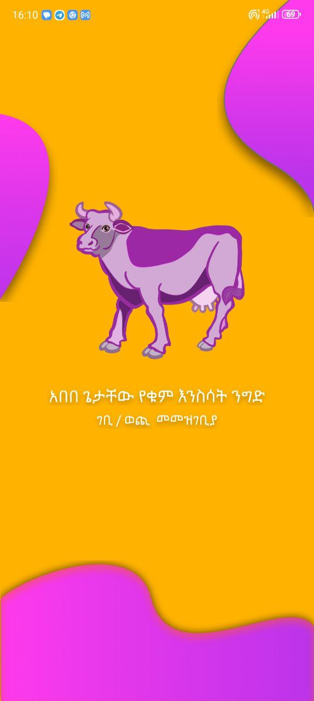
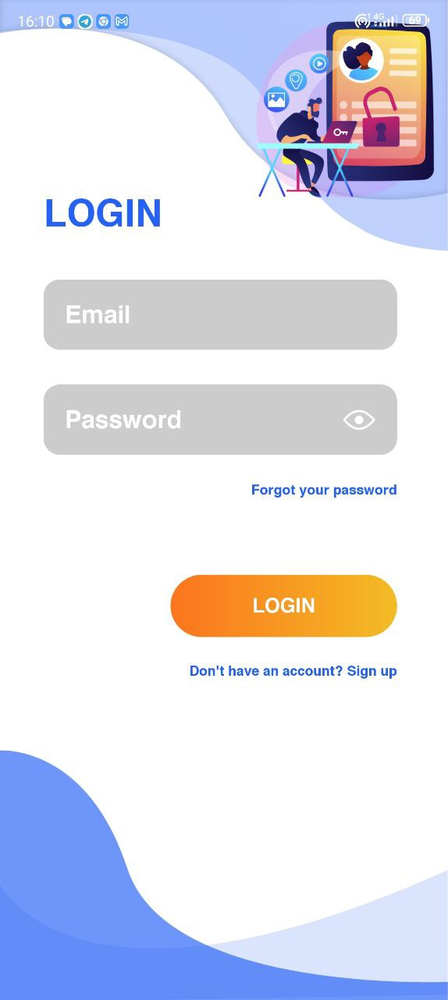
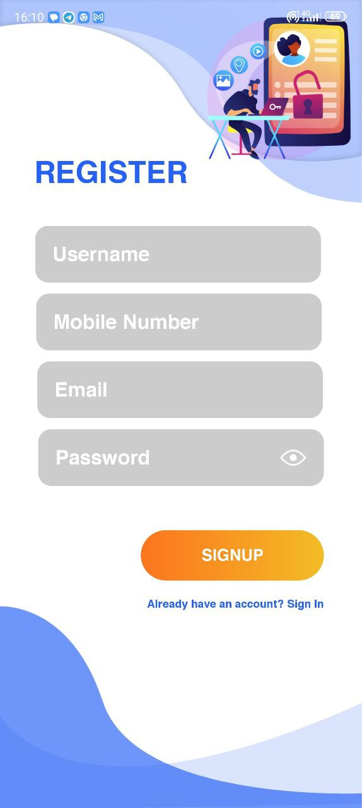
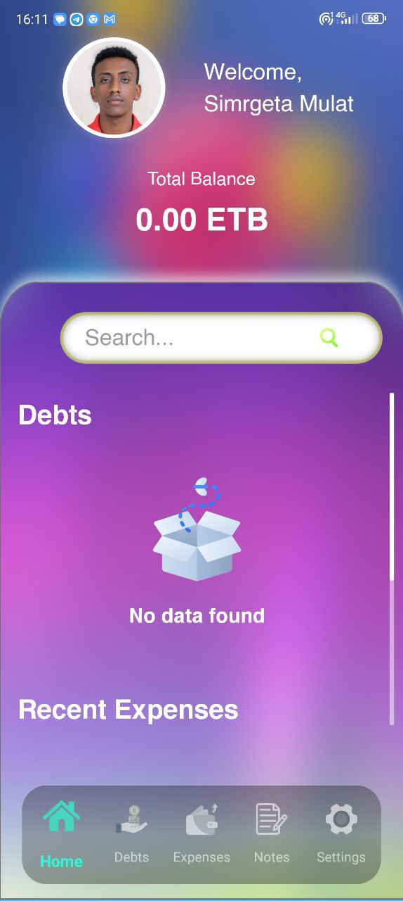
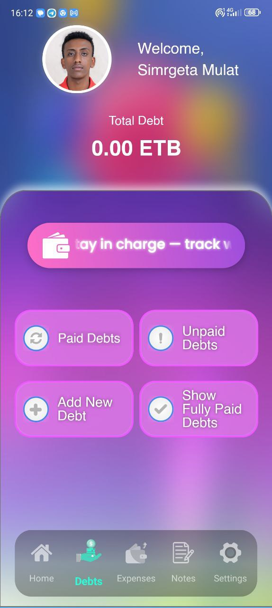
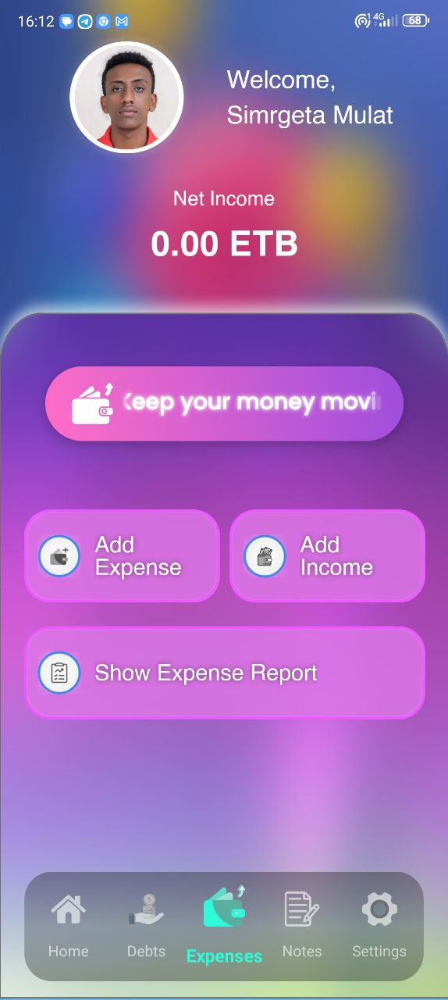
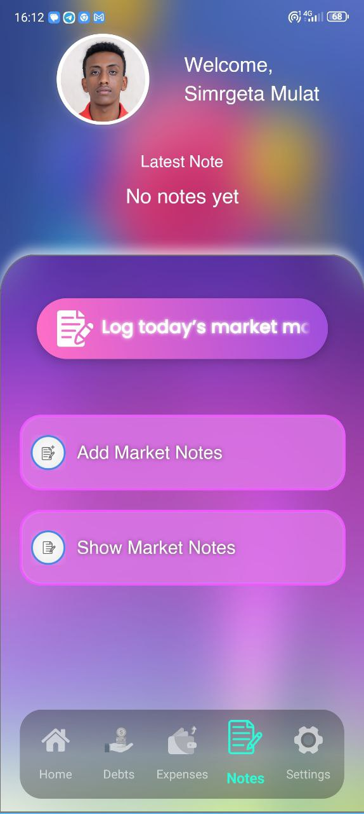
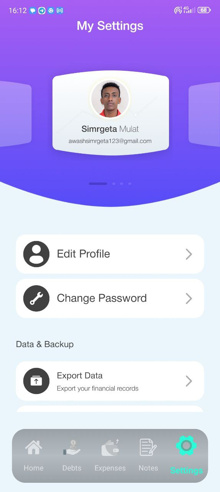

# Abebe Getachew


## Table of Contents

-  [Introduction](#introduction)

-  [Features](#features)

-  [Screenshots](#screenshots)

-  [Tech Stack](#tech-stack)

-  [Installation](#installation)

-  [Usage](#usage)

-  [License](#license)

-  [Contact](#contact)

***

## Introduction
Abebe Geatchew is a salary management app. It's designed to solve the problem of many people who to struggle to keep tack of their money who owed them, their inncome, expenses,  , logging their market notes and a whole lot more which makes it easy for users to handle money flow and manage their business free of worries.

This project was developed with a focus on clean architecture, beautiful UI, and high performance.

## Features
**Easy Accessiblity**: Users can use the app whenever they want day and night, anywhere they go as long as they got their smart phone with them.

**Backup**: Users can export and import their data securely both on local devices and also on cloud servers.

**Security**: Users data is stored safely and securely. There is almost 0% of security breach on the architecture of the software. Users can login and use our services securely free of worries.

**Keeping track of your loans**: Users can track people who owe them, how much they owe them, when and every little tiny details about the loan, and follow up the payment.

**Recording Income/Expenses**: Users can record their income and expenses so they will be much more productive.

**Logging Market experience**: Users can log their day in the market. They can log what they experienced, what they bought and the price of the item and much more.

## Screenshots 

<table>
  <tr>
    <td align="center"><b>Splash</b><br></td>
    <td align="center"><b>Login</b><br></td>
  </tr>
  <tr>
    <td align="center"><b>Register</b><br></td>
    <td align="center"><b>Home</b><br></td>
  </tr>
  <tr>
    <td align="center"><b>Debts</b><br></td>
    <td align="center"><b>Expenses</b><br></td>
  </tr>
  <tr>
    <td align="center"><b>Notes</b><br></td>
    <td align="center"><b>Settings</b><br></td>
  </tr>
</table>


## Tech Stack

**This project uses the following technologies and libraries**:

**Language**: Java

**Architecture**: The project uses the **MVVM (Model-View-ViewModel)** architecture, supported by **Android Architecture Components** such as `LiveData` and `ViewModel`.

**UI**: **XML Layouts**, with modern components from **Material Design**.

**Database**: **Google Firebase** for its various cloud database services, including **Firestore**, **Realtime Database**, and **Cloud Storage**.

**Networking**: **OkHttp** for handling networking and HTTP requests, with `Logging Interceptor` for debugging.

**Other Libraries**:
* **Google Firebase**: Used for **Authentication** and **Cloud Functions**.
* **Google Play Services**: Manages authentication with Google.
* **Google APIs**: Integrates with **Google Drive API**.
* **Microsoft Graph**: Integrates with Microsoft services, using **MSAL** for authentication.
* **Dropbox Core SDK**: Enables integration with Dropbox.
* **Glide**: For efficient image loading and caching.
* **uCrop**: For image cropping functionality.
* **Lottie**: For high-quality animations.
* **CircleImageView** and **Glowbutton**: For custom UI components.
* **Android Mail** and **Android Activation**: For email sending capabilities.

  
## Installation

To get a local copy up and running, follow these steps.

### 1. Clone the repository:

```bash
git clone https://github.com/Simrgeta/Abebe-Geatchew-App.git
```

### 2. Open in Android Studio:
* **Open Android Studio and select** `File > Open`
* **Navigate to the cloned repository and open it.**

### 3. Run the app:
* **Connect a physical device or set up an emulator.**
* **Click the** `Run` **button in Android Studio.**

## Usage

You can use the app for day to day marketing activities, while shoopping, for contolling your cash flow, etc...
Here is a step by step guide to start using the app:

1. Launch the app.
2. Wait for a few ssconds and you will see a login page. If you already have an account, just log in. If you dont have an account, tap `Don't have an account? Sign up` then enter your information and verify your account.
3. That's it! You can now enjoy all our services anytime, anywhere.

**Note: You must always turn on** `Mobile Data` **or** `Wi-Fi` **when the app is launching or while you export data to cloud servers. After the app finished loading, you can turn off your mobile data or wi-fi**

## License

This project is licensed under a custom license.  
See the [LICENSE](LICENSE) file for more details.

# ⚠️ NOTICE: PROPRIETARY SOFTWARE

This software is proprietary and licensed under the terms of the **End-User License Agreement (EULA)** below.  
- ❌ Forking this repository is **not permitted**.  
- ❌ Redistribution, resale, or commercial use without permission is **strictly prohibited**.  
- ✅ You may only use this software under the license terms granted by the Licensor.  

---

# END-USER LICENSE AGREEMENT

**Effective Date:** September 1, 2025  

This End-User License Agreement ("Agreement") is a binding legal contract between **Simrgeta Awash**, an individual residing in Ethiopia ("Licensor"), and you, the end-user ("Licensee").  

---

## WHEREAS
- Licensor is the sole and exclusive owner of all rights, title, and interest in and to the proprietary software known as **Abebe Getachew** (the "Software"); and  
- Licensor is willing to grant a limited, non-exclusive license to use the Software, subject to the terms and conditions hereinafter set forth;  

NOW, THEREFORE, in consideration of the mutual covenants and agreements contained herein, the parties agree as follows:  

---

## 1. DEFINITIONS
- **"Software"** means the proprietary software known as *Abebe Getachew*, including all its components, modules, object code, source code, data, documentation, and all updates, upgrades, and modifications thereto.  
- **"Licensee"** means the individual or legal entity who accepts the terms of this Agreement.  
- **"Licensor"** means Simrgeta Awash.  

---

## 2. LICENSE GRANT
Pursuant to the terms and conditions of this Agreement, Licensor grants to Licensee a **limited, revocable, non-exclusive, non-transferable, non-sublicensable** license to install and use a single copy of the Software on a single authorized device for the Licensee's **internal, non-commercial use only**.  
The Software is licensed, not sold, to Licensee.  

---

## 3. RESTRICTIONS
Licensee shall not, and shall not permit any third party to:  

a. Copy, reproduce, modify, translate, reverse engineer, decompile, or disassemble the Software, or attempt to discover or derive the source code or underlying algorithms of the Software.  
b. Distribute, sell, rent, lease, lend, sublicense, assign, or otherwise transfer the Software or any of the rights granted herein.  
c. Remove, alter, or obscure any copyright, trademark, patent, or other proprietary rights notices from the Software.  
d. Use the Software in any manner that is illegal or not expressly authorized by this Agreement.  
e. Use the Software for any commercial purpose, including but not limited to resale, service bureau use, or as a component of any commercial product or service, without a separate and written commercial license from Licensor.  

---

## 4. OWNERSHIP AND INTELLECTUAL PROPERTY
Licensee acknowledges that all intellectual property rights, including but not limited to copyrights, patents, trademarks, and trade secrets, in the Software and any derivatives, modifications, or improvements thereof, are and shall remain the **exclusive property of the Licensor**.  
This Agreement does not grant Licensee any ownership interest in the Software.  

---

## 5. CONFIDENTIALITY
The Software and its underlying source code are considered confidential and proprietary information of the Licensor.  
Licensee shall maintain the confidentiality of the Software and shall not disclose or provide access to the Software to any third party without Licensor's prior written consent.  

---

## 6. TERM AND TERMINATION
This Agreement is effective upon the date of Licensee's first use or installation of the Software and shall remain in effect until terminated.  
Licensor may terminate this Agreement immediately and without notice upon any breach by Licensee.  

Upon termination, Licensee shall immediately cease all use of the Software and destroy all copies of the Software in its possession.  

The provisions of Sections **3, 4, 5, 6, 7, and 8** shall survive any termination of this Agreement.  

---

## 7. DISCLAIMER OF WARRANTIES
THE SOFTWARE IS PROVIDED **"AS IS" AND "AS AVAILABLE,"** WITH ALL FAULTS, AND WITHOUT WARRANTY OF ANY KIND.  

TO THE MAXIMUM EXTENT PERMITTED BY LAW, LICENSOR EXPRESSLY DISCLAIMS ALL WARRANTIES, WHETHER EXPRESS, IMPLIED, OR STATUTORY, INCLUDING THE IMPLIED WARRANTIES OF MERCHANTABILITY, FITNESS FOR A PARTICULAR PURPOSE, TITLE, AND NON-INFRINGEMENT.  

LICENSOR DOES NOT WARRANT THAT THE SOFTWARE WILL BE UNINTERRUPTED, ERROR-FREE, OR FREE OF VIRUSES OR OTHER HARMFUL COMPONENTS.  

---

## 8. LIMITATION OF LIABILITY
IN NO EVENT SHALL LICENSOR BE LIABLE FOR ANY INCIDENTAL, INDIRECT, SPECIAL, PUNITIVE, CONSEQUENTIAL, OR SIMILAR DAMAGES, INCLUDING, BUT NOT LIMITED TO, LOSS OF PROFITS, DATA, OR USE, ARISING OUT OF OR IN CONNECTION WITH THE USE OR INABILITY TO USE THE SOFTWARE, EVEN IF LICENSOR HAS BEEN ADVISED OF THE POSSIBILITY OF SUCH DAMAGES.  

IN NO CASE SHALL THE AGGREGATE LIABILITY OF LICENSOR EXCEED THE AMOUNT PAID BY LICENSEE FOR THE SOFTWARE.  

---

## 9. GOVERNING LAW AND JURISDICTION
This Agreement shall be governed by and construed in accordance with the laws of **Ethiopia**, without regard to its conflict of laws principles.  

The parties agree that the exclusive jurisdiction for any dispute arising out of this Agreement shall be in the courts of the **Federal Supreme Court of Ethiopia**.  

---

## 10. ENTIRE AGREEMENT AND SEVERABILITY
This Agreement constitutes the **entire understanding** between Licensor and Licensee concerning the subject matter hereof and supersedes all prior and contemporaneous discussions, understandings, and agreements, whether written or oral.  

If any provision of this Agreement is held to be invalid or unenforceable, the remaining provisions shall continue in full force and effect.  


***

## Contact

Simrgeta Awash Mulat - [awashsimrgeta123@gmail.com](mailto:awashsimrgeta123@gmail.com)

Project Link - [https://github.com/Simrgeta/Abebe-Geatchew-App](https://github.com/Simrgeta/Abebe-Geatchew-App)
